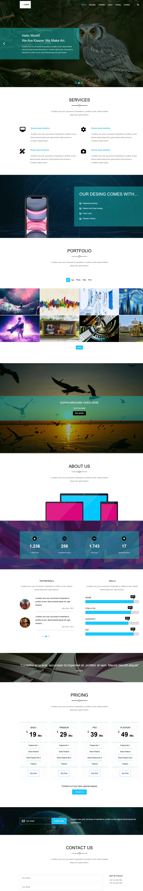
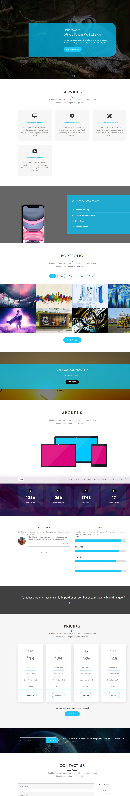

# Kasper | Creative Portfolio Template (Modernized)


[](https://engali983.github.io/HTML_And_CSS_Template_Two/)
[](https://developer.mozilla.org/en-US/docs/Web/Guide/HTML/HTML5)
[](https://developer.mozilla.org/en-US/docs/Web/JavaScript)

## 🚀 Overview

**Kasper** is a responsive, single-page creative portfolio template.
Originally started as a classic HTML/CSS structure (based on Elzero Web School's Template Two), this project has been **completely re-engineered** to meet modern web standards.

The goal was to transform a static layout into a dynamic, interactive user experience using Vanilla JavaScript, introducing **Dark Mode**, **Portfolio Filtering**, and **Scroll Animations** without relying on external libraries.

---

## 🔄 The Evolution (Before vs. After)

This project represents my journey from static design to dynamic interactivity.

| Feature | Original Version (The Start) | Modernized Version (Current) |
| :--- | :--- | :--- |
| **Theme** | Fixed Light Mode | **Dark / Light Mode Toggle** (Saved in LocalStorage) |
| **Interactivity** | Static Images | **Dynamic Filtering**, Sliders, & Counters |
| **User Experience** | Basic Links | **Sticky Header**, Smooth Scroll, Scroll-to-Top |
| **Code Structure** | `<div>` based Layout | **Semantic HTML5** & Modular CSS Variables |

### Visual Comparison

| Before (Classic) | After (Modern Redesign) |
| :---: | :---: |
|  |  |

---

## ✨ Key Features

### 🛠 UI/UX Enhancements
* **Dark Mode Support:** A fully functional theme switcher that respects user preference and saves it for future visits.
* **Modern Typography:** Clean usage of **Jost** and **Open Sans** fonts for a professional look.
* **Responsive Design:** A custom **Burger Menu** for mobile devices and a grid system that adapts seamlessly to all screen sizes.

### ⚡ JavaScript Implementations
* **Portfolio Filter:** Filter project images dynamically by category (App, Web, Photo, Print) instantly.
* **Scroll Animations:** Used **Intersection Observer API** to trigger fade-up and slide-in animations as the user scrolls.
* **Animated Statistics:** Numbers in the "Stats" section count up automatically when viewed.
* **Testimonials Slider:** Interactive slider logic for client reviews.

---

## 🛠️ Technologies Used

* **HTML5:** Semantic Structure (`header`, `section`, `nav`).
* **CSS3:** CSS Variables (`:root`), Flexbox, CSS Grid, Media Queries.
* **JavaScript (ES6+):** DOM Manipulation, LocalStorage, Event Delegation, Intersection Observer.
* **Font Awesome:** For scalable vector icons.
* **Google Fonts:** Jost & Open Sans.

---

## 🗺️ Roadmap & Future Improvements

I am constantly working to improve this template. Here is the progress:

- [x] **Phase 1: Structure** (Semantic HTML conversion).
- [x] **Phase 2: UI Overhaul** (CSS Variables, Responsive Grid).
- [x] **Phase 3: JS Core** (Menu Toggle, Portfolio Filter, Stats Counter).
- [x] **Phase 4: Dark Mode** (Theme implementation with LocalStorage).
- [x] **Phase 5: Performance** (Lazy loading for images).
- [ ] **Phase 6: Contact Form** (Backend integration).

---

## 📂 Project Structure

```bash
├── css
│   ├── kasper.css      # Main Stylesheet (Variables & Components)
│   ├── normalize.css   # CSS Reset
│   └── all.min.css     # Font Awesome
├── js
│   └── main.js         # Logic (Filter, Dark Mode, Observer)
├── images              # Project Assets & Screenshots
├── index.html          # Main Structure
└── README.md           # Documentation
```
---

## 🤝 Acknowledgements

* **Original Layout Inspiration:** [Elzero Web School](https://elzero.org)
* **Icons:** [Font Awesome](https://fontawesome.com)
* **Fonts:** [Google Fonts](https://fonts.google.com)

---

### ❤️ Connect

If you like this project, feel free to star the repo ⭐️!

**Ali** - [GitHub Profile](https://github.com/engali983)
