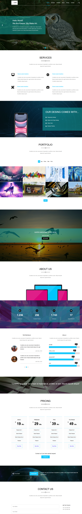
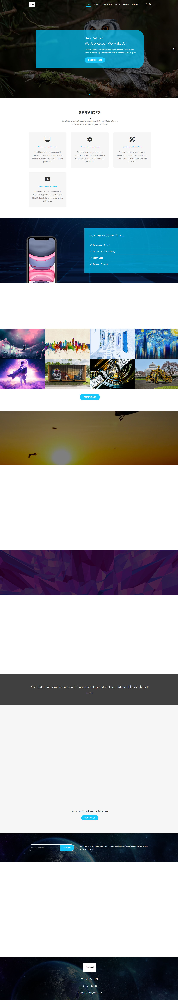

# 🎨 Kasper | Creative Portfolio (Enhanced Edition)

> **From Static to Dynamic:** A complete modernization of the classic "Kasper" template.

This project represents a milestone in my Front-End development journey. It started 10 months ago as a static HTML/CSS practice based on [Elzero Web School](https://elzero.org/) design. Today, I have completely re-engineered it to demonstrate modern web standards, **JavaScript interactivity**, **Dark Mode**, and **Semantic HTML**.

## 🚀 Live Demo
[Click here to view the live project](#) ---

## 📸 Transformation Showcase (Before vs. After)

### 1. The Legacy Version (10 Months Ago)
*Static layout, basic CSS, no interactivity.*


### 2. The Enhanced Version (Current)
*Modernized with Dark Mode, Scroll Animations, Interactive Filtering, and Clean UI.*


---

## 🔄 The Technical Evolution

| Feature | 🕸️ Legacy Version (Old) | 🚀 Enhanced Version (New) |
| :--- | :--- | :--- |
| **Tech Stack** | HTML & CSS Only | HTML5, CSS3, **JavaScript (ES6+)** |
| **Theme** | Fixed Light Mode | **Dark / Light Mode Toggle** (Saved in LocalStorage) |
| **Structure** | `<div>` based (Non-Semantic) | **Semantic HTML5** (SEO & A11y Friendly) |
| **Portfolio** | Static Images | **Dynamic Filter** (Sort by Category) |
| **Animations** | None | **Scroll Reveal** (Intersection Observer) & Counters |
| **Navigation** | Basic Links | **Sticky Header** & **Mobile Burger Menu** |

---

## ✨ Key Features (New Implementation)

### 🌗 Dark/Light Mode
- Users can toggle between themes.
- Preference is **saved automatically** in `LocalStorage`, so it remembers the choice on reload.

### 🖼️ Interactive Portfolio
- Filter projects by category (App, Web, Photo, Print) instantly without page reload using vanilla JavaScript.

### 🔢 Animated Statistics
- Numbers in the "Stats" section count up automatically when the user scrolls to them.

### 📱 Fully Responsive
- A custom **Burger Menu** for mobile devices with smooth toggle animations.
- Grid and Flexbox layouts adapt seamlessly to all screen sizes.

### 🎬 Scroll Animations
- Elements fade in and slide up as you scroll down using the modern `IntersectionObserver` API for better performance.

---

## 🛠️ Technologies Used

- **HTML5:** Semantic tags (`<header>`, `<section>`, `<footer>`, `<nav>`).
- **CSS3:** Custom Properties (Variables), Flexbox, CSS Grid, Media Queries.
- **JavaScript (ES6+):** DOM Manipulation, Event Handling, LocalStorage, Clean Code architecture.
- **Font Awesome:** For icons.
- **Google Fonts:** (Jost & Open Sans).

---

## 📂 Project Structure

```text
/
├── index.html          # Main Semantic HTML structure
├── css/
│   ├── kasper.css      # Main styling & Dark Mode variables
│   ├── normalize.css   # Browser consistency
│   └── all.min.css     # Icon library
├── js/
│   └── main.js         # Logic: Filter, Toggle, Animations, LocalStorage
├── images/             # Assets & Screenshots (old/new design)
└── README.md           # Documentation